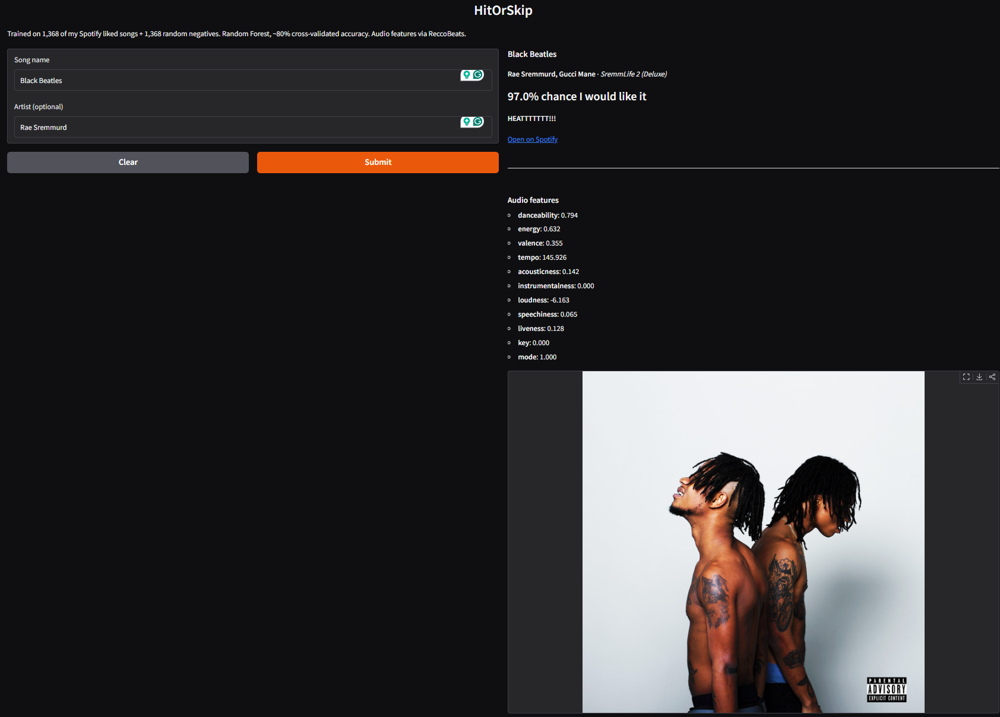
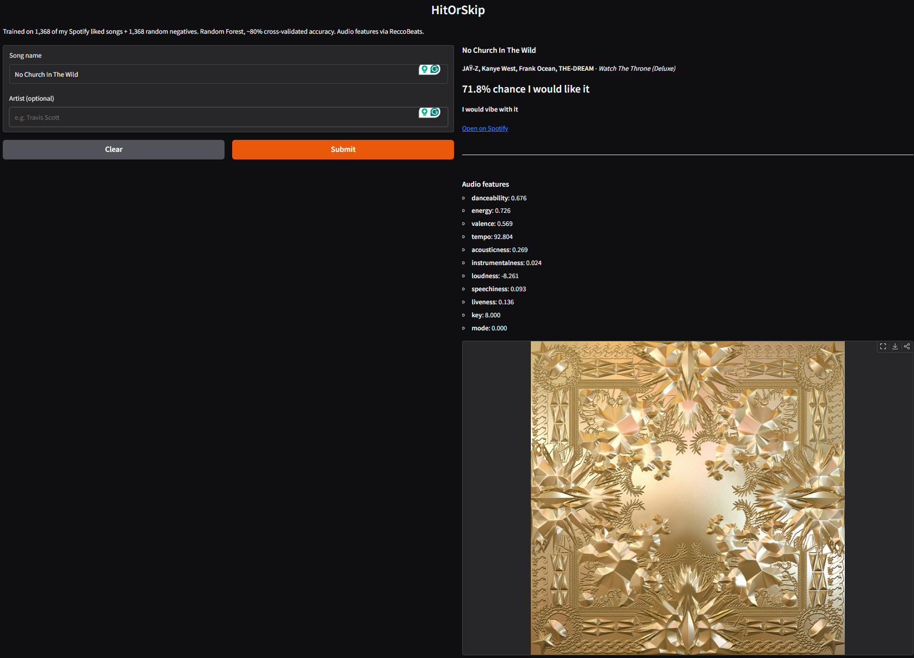
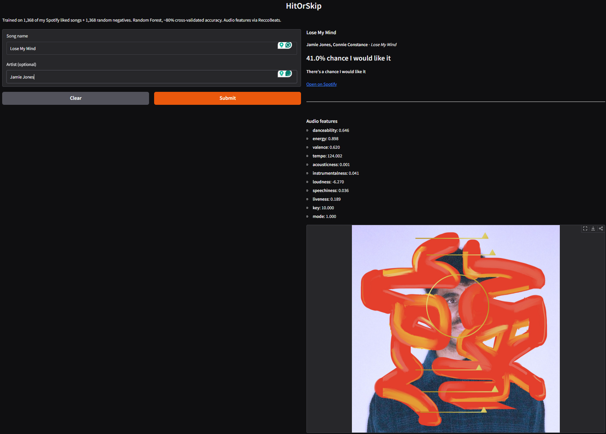
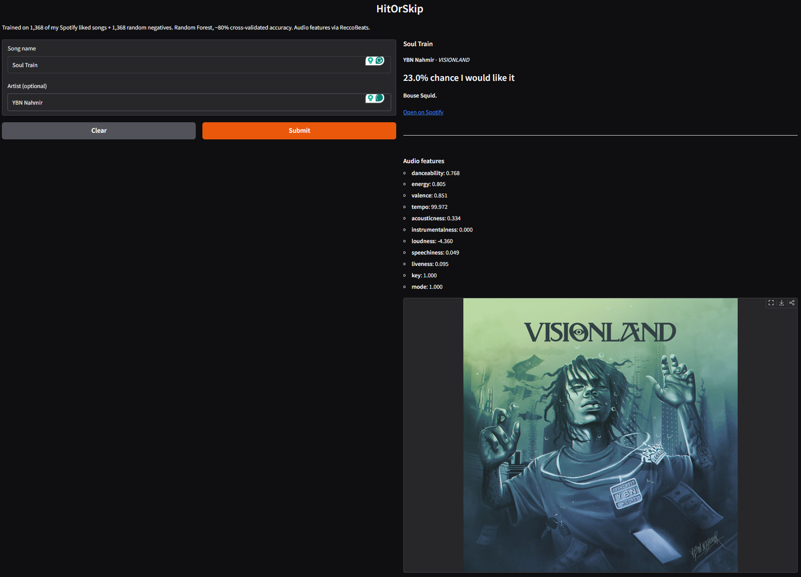
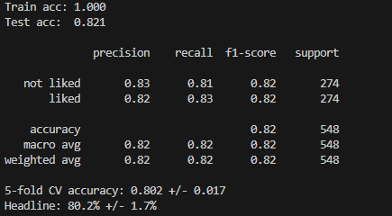
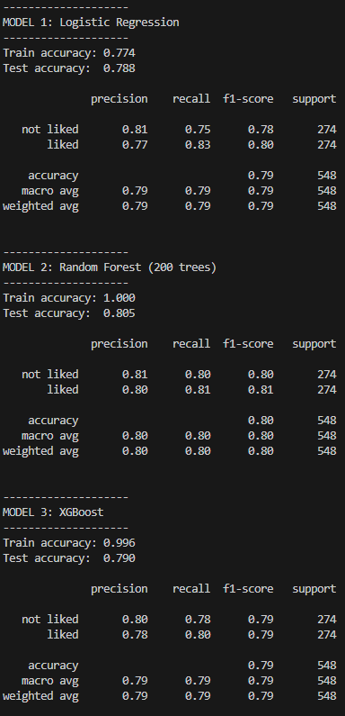
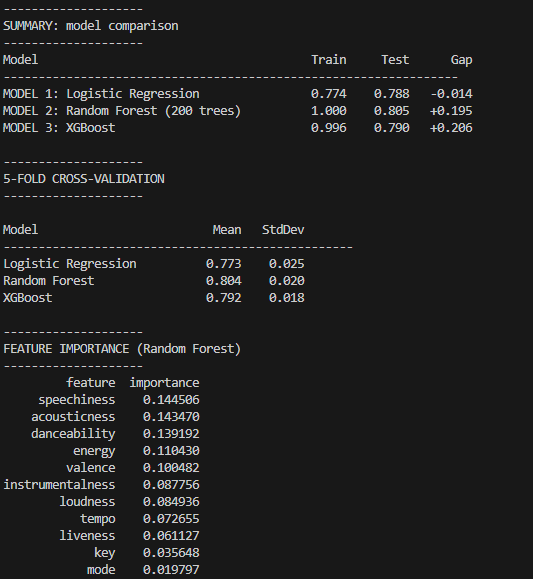

# HitOrSkip

Predicts whether I'd like a song based on audio features, trained on my personal Spotify listening history (80% cross-validated accuracy).

> **Note:** The model included in this repo is trained on *my* taste. If you want it to predict *your* taste, follow the setup guide below to build your own dataset and retrain.

---

## Demo

| High match | Mid match | Low match | Very low |
|---|---|---|---|
|  |  |  |  |
| Black Beatles — Rae Sremmurd | No Church In The Wild — Jay-Z & Kanye | Lose My Mind - Jamie Jones | Soul Train - YBN Nahmir|

The model correctly identified that I gravitate toward high-energy, bass-heavy hip-hop and trap, and pushed back on anything acoustic, slow, or instrumental.

---

## How it works

1. You type a song name into the Gradio app
2. The **Spotify API** resolves it to a track ID
3. The **ReccoBeats API** returns 11 audio features for that track (danceability, energy, valence, tempo, acousticness, instrumentalness, loudness, speechiness, liveness, key, mode)
4. A **Random Forest classifier** takes those 11 numbers and returns the probability I'd like it

The whole prediction takes about 2–4 seconds end to end.

---

## How it works

### The data problem

My original plan was to use Spotify's own audio features API (`GET /audio-features`). Spotify deprecated this endpoint for new developer apps in late 2024, so that wasn't an option.

I evaluated three alternatives:

| Option | What happened |
|---|---|
| Kaggle 1.2M-track dataset |  Further research revealed it was full of filler artists (Vitamin String Quartet, Mannheim Steamroller). 16% match rate with my library.|
| maharshipandya 114K-track dataset (Hugging Face) | Better, but only 28% match — caps at 1,000 tracks per genre, missing most modern hip-hop |
| **ReccoBeats API** | 85% coverage of my library, free, no key required. Chose this. |

A big thanks to **[ReccoBeats](https://reccobeats.com/)** — this API saved this project. They built a free replacement for Spotify's deprecated audio features endpoint that works on current and recent releases. Highly recommend if you're building anything music-related.

### Building the "not liked" set

Every ML classifier needs negative examples, songs I *wouldn't* like. I used the **[maharshipandya Spotify Tracks Dataset](https://huggingface.co/datasets/maharshipandya/spotify-tracks-dataset)** on Hugging Face for this, and it turned out to be a good fit for an unexpected reason.

The dataset is curated across 125 genres and includes a lot of music I simply don't listen to — acoustic, classical, folk, country, ambient. I filtered out any artists already in my liked list to reduce label noise, then randomly sampled 1,368 tracks as negatives (the amount of liked songs I have). Because my taste is so heavily hip-hop and trap, the contrast between my liked songs and these random samples was sharp enough for the model to learn clear patterns.

I don't like most of what's in that dataset. That's exactly why it worked.

### Why Random Forest over other models

I compared three models on the same data:

| Model | CV Accuracy | Std Dev |
|---|---|---|
| Logistic Regression | 77.3% | ±2.5% |
| **Random Forest ⭐** | **80.3%** | **±2.5%** |
| XGBoost | 79.2% | ±1.8% |

Random Forest performed best. XGBoost usually wins on tabular data, but with only ~2,700 rows and default hyperparameters, Random Forest got the edge. Logistic regression came surprisingly close, which tells you the relationship between audio features and my taste is mostly linear, not deeply complex.

One note: the Random Forest has a ~18% train-test gap (it hits 100% training accuracy) because decision trees memorize training data by default. The cross-validated 80.3% is the real number. Hyperparameter tuning (`max_depth`, `min_samples_leaf`) is the planned fix.

### What my taste looks like mathematically

Top features by importance:

| Feature | Direction | Translation |
|---|---|---|
| Danceability | ↑ liked | I want groove and rhythm |
| Speechiness | ↑ liked | I listen to a lot of rap |
| Acousticness | ↓ liked | I dislike acoustic music  |
| Instrumentalness | ↓ liked | I want vocals |
| Loudness | ↑ liked | Loud, compressed modern production |
| Valence | ↓ liked | I lean darker/moodier |

Top 30 artists in my library: Drake (120 tracks), Travis Scott (103), Lil Uzi Vert (89), Future (84), Playboi Carti (69), Kanye West (64), The Weeknd (50), Young Thug (48). The model learned exactly what you'd expect.

---

## Model Evaluation



- **Train acc 1.000** — model memorized training data ( not the real number)
- **Test acc 0.821** — correctly predicted 82% of songs it had never seen
- **Precision 0.82** — when it said I'd like a song, it was right 82% of the time
- **Recall 0.83** — it found 83% of songs I actually like
- **5-fold CV 80.2% ± 1.7%** —  averaged across 5 different splits, consistent results

---

### All three models compared



- **Logistic Regression (78.8% test)** — simplest model, draws a straight line between liked and not liked
- **Random Forest (80.5% test)** — 200 trees averaged together, best performance, chosen model
- **XGBoost (79.0% test)** — usually the strongest on tabular data but lost here due to small dataset size

---

### Summary & feature importance



The top three features driving predictions:

- **Speechiness** — how lyrics-heavy a track is. High = rap = liked.
- **Acousticness** — low acousticness (produced, electronic) = liked. My strongest consistent preference.
- **Danceability** — groove-driven tracks score higher. Beat-first listening confirmed.

The model learned my taste purely from numbers, no genre labels, no artist names. It figured out I listen to rap on its own.

---

## What I learned building this

This was my first real ML project, built while working through Kaggle's pandas and machine learning courses. I wanted to put what I was learning into practice on something I actually cared about rather than just doing the course exercises, so instead of predicting house prices or titanic survivors like every tutorial, I wanted to personalize it and train something on my own music taste.

While building the project I ran into some issues:

**Data is the hardest part.** I spent more time getting clean, labeled data than I did training models. Spotify's API deprecation forced me to evaluate three different data sources, check each one against known songs, and pivot when datasets didn't match what they advertised. The Kaggle pandas course taught me how to load and manipulate DataFrames, this project taught me what happens when the data is broken before it even gets to you.

**Quality matters more than row counts.** The first Kaggle dataset had 1.2M rows and sounded perfect. It was full of Vitamin String Quartet and Mannheim Steamroller. Row count means nothing without checking what's actually in the data, something the courses mention but you only really realize when you've wasted an hour on the wrong dataset.

**The "right" model depends on your data.** The Intro to ML and Intermediate ML courses on Kaggle cover decision trees, random forests, and XGBoost. I trained all three on my dataset and compared them honestly with cross-validation, the same evaluation methodology the courses taught. XGBoost is usually the strongest on tabular data, but it lost to Random Forest here because the dataset was small and hyperparameters weren't tuned. This taught me picking the right algorithm isn't about following a ranking, it's about testing on your actual data, which is exactly what the courses emphasize.

**Cross-validation is extremely important.** One of the biggest things I took from the Intermediate ML course was why a single train/test split isn't enough. Reporting "80.3% ± 2.5% across 5 folds" is a better claim than "I got 82% on my test set once." That distinction matters, and I wouldn't have known to care about it without the course.

**Your model is a mirror.** The feature importance output told me things about my taste I already knew but hadn't quantified. High danceability, high speechiness, low acousticness, in simpler terms that's just "I listen to rap." Seeing it confirmed by a model trained purely on numbers, with no genre labels involved, was the moment the whole project clicked for me.

The gap between "finished the course" and "built something real" is bigger than I expected. I'd recommend anyone going through the Kaggle ML courses to find a dataset they actually care about and build something with it before moving to the next lesson. The exercises teach you the syntax. A real project teaches you the logic.

---

## Stack

- **Python** — core language
- **scikit-learn** — Random Forest, model evaluation, cross-validation
- **pandas** — data wrangling
- **Gradio** — web interface
- **[Spotipy](https://spotipy.readthedocs.io/)** + **[Spotify Web API](https://developer.spotify.com/documentation/web-api)** — pulling liked tracks, searching songs
- **[ReccoBeats API](https://reccobeats.com/)** — audio feature retrieval (free, no key required)
- **[maharshipandya/spotify-tracks-dataset](https://huggingface.co/datasets/maharshipandya/spotify-tracks-dataset)** — source of negative training examples
- **joblib** — saving and loading the trained model

---

## How to run it

### Prerequisites

- Python
- A [Spotify Developer account](https://developer.spotify.com/dashboard) (free) — needed to search songs in the app and to build your own dataset

### Quick start (use my pre-trained model)

```bash
git clone https://github.com/anuragvee/HitOrSkip.git
cd HitOrSkip
pip install -r requirements.txt
```

Copy `.env.example` to `.env` and fill in your Spotify credentials:

```
SPOT_ID=your_spotify_client_id_here
SPOT_SECRET=your_spotify_client_secret_here
```

Get your credentials at [developer.spotify.com/dashboard](https://developer.spotify.com/dashboard) — create a new app and set the redirect URI to `http://127.0.0.1:8888/callback`.

Then launch:

```bash
python app.py
```

Open `http://127.0.0.1:7860` in your browser.

> **Remember:** the included model (`prev_model.pkl`) predicts *my* taste, not yours. Songs I love will score high; songs you love might not. To personalize it, follow the steps below.

### Build your own model (personalize for your taste)

Run the three data scripts in order:

```bash
# 1. Pull your liked tracks from Spotify
python scripts/getliked.py

# 2. Fetch audio features from ReccoBeats
python scripts/reccofile.py

# 3. Build the labeled training dataset
python scripts/finaltrainingset.py

# 4. Train and save your model
python train.py

# 5. Launch the app
python app.py
```

Step 2 takes 10–15 or 20 minutes, it fetches features for ~1,600 tracks one batch at a time and saves a checkpoint after every batch so you can resume if it gets interrupted due to some unforseen error.

---

## What's next

- **Hyperparameter tuning** — reducing the ~18% train-test gap with `max_depth` and `min_samples_leaf` constraints on the Random Forest
- **Better negatives** — sampling from adjacent genres (R&B, pop) instead of random tracks, making the classification problem harder and more useful

---

## Acknowledgments

Special thanks to **[ReccoBeats](https://reccobeats.com/)** for providing a free audio features API after Spotify deprecated theirs, this project wouldn't exist without it.